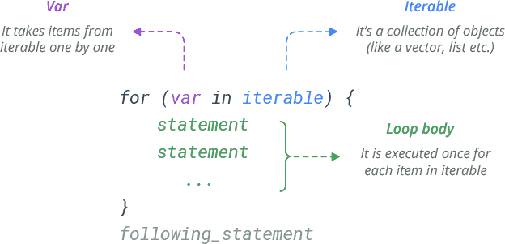

```{r setup, include=FALSE}
knitr::opts_chunk$set(echo = TRUE)
knitr::opts_knit$set(root.dir = '/Users/nicholaskortessis/Library/CloudStorage/GoogleDrive-kortessn@wfu.edu/My Drive/Import/Wake Forest/Teaching/24-25/2025 - Spring/BIO 380/Lab/Wk7')
```

# Bootstrapping

Bootstrapping is a modern computational tool used in statistics to do estimation. Bootstrapping is the process of re-using data to construct sampling distributions, rather than relying on proofs about particular sampling distributions.

Bootstrapping is helpful in two contexts:

1.  When you want to estimate something simple, but your data violate typical assumptions used to generate sampling distributions

2.  When you want to estimate something complex and no one has ever derived a sampling distribution (or at least you are unaware of one).

We will take each of these in turn. But before we get to doing bootstrapping, let's review the general methodology.

## Bootstrapping Steps

1.  Decide on the population parameters you want to estimate.

2.  Decide on a sample property that you can calculate from a sample to estimate the population parameter. Call this **estimator** $\theta$. $\theta$ is given the name **estimator** because it is a method to estimate the population parameter.

3.  Randomly sample your population. Call this sample data $\mathbf{X}$.

4.  Calculate $\theta$ for your sample $\mathbf{X}$. Call the value of $\theta$ from your sample $\hat{\theta}$. The hat indicates that it is an **estimate** and not an **estimator**. This may seem confusing, but here is a concrete example. $\bar{X} = \frac{1}{n}\sum_i^n X_i$, the mean, is an **estimator** because it is a *method* to estimate the population mean. Once we have data in hand, say $\mathbf{X} = \{X_1 = 2, X_2 = 0.5, X_3 = 5\}$, then we have $\hat{\bar{X}} = 2.5$, which is an **estimate** because it is a specific *number* rather than a method.

5.  Re-sample the data $\mathbf{X}$ *with replacement*. Call this new, *bootstrapped sample* $\mathbf{X}_{\text{boot,}1}$. This notation represents a boostrapped sample, and it is the first one.

6.  Calculate $\hat{\theta}_{\text{boot,}1}$ as the estimate for this first bootstrapped sample. Store this estimate.

7.  Repeat steps 5-6 many times (at least 10,000). You should now have a collection of bootstrapped sample estimates. If you run 10,000 bootstrapped samples, the collection looks like $\hat{\mathbf{\theta}}_{boot} = \{\hat{\theta}_{\text{boot,}1}, \hat{\theta}_{\text{boot,}2}, \hat{\theta}_{\text{boot,}3}, \ldots, \hat{\theta}_{\text{boot,}9999},\hat{\theta}_{\text{boot,}10000}\}$.

8.  Plot a histogram of the bootstrapped samples. This is a psuedo-sampling distribution.

9.  Calculate properties of interest related to a sampling distribution (e.g., standard erors and confidence intervals).

You have most of the tools in your coding toolbox to be able do this. One tool you do not yet have that is crucial to making this work is the ability to repeat a process many times. To do that, we need to introduce the idea "for loops".

## "for loops" - A convenient way to repeat calculations

We need to repeat a process many many times to do bootstrapping. It would be laborious to do that by hand. Let's show a quick example where we need to a calculation multiple times.

Let's go back to our coin flipping example from the first lab. We wanted to flip coins and keep track of how many heads show up in the collection of coins.

```{r}
coin <- c("H", "T") # Make a coin
n.coins <- 50 # Decide how many times to toss it
flipped.coins <- sample(coin, size = n.coins, replace = T) # Toss em!
# Calculate the last head
(last.head <- max(which(flipped.coins == "H")))
```

Okay. So we got that result, but we could have gotten a different result. To see who different the results may be, let's go ahead and do the whole thing again. I'm going to just copy and paste the thing from above.

```{r}
flipped.coins <- sample(coin, size = n.coins, replace = T) # Toss em!
(last.head <- max(which(flipped.coins == "H")))
```

Hey, we got something different. Let's do it again a few more times (again, by copying and pasting a few times).

```{r}
flipped.coins <- sample(coin, size = n.coins, replace = T) # Toss em!
(last.head <- max(which(flipped.coins == "H")))

flipped.coins <- sample(coin, size = n.coins, replace = T) # Toss em!
(last.head <- max(which(flipped.coins == "H")))

flipped.coins <- sample(coin, size = n.coins, replace = T) # Toss em!
(last.head <- max(which(flipped.coins == "H")))
```

Now we've got 5 times of doing this. Should we just keep copying and pasting 10,000 times?! Absolutely not. R has a way to do this that is called a "for loop". For loops have the following code structure.



The variable `var` is just a name that indexes a thing that changes value. The values that the variables takes is given by the `iterable`. These are often integers, but can be also be a list or vector of strings. For each value of `var` defined in `iterable`, the `loop body` gives the set of code to do. For loops work by first making the value of `var` the first entry of `iterable` and then executing lines of code in the `loop body`. Once those lines of code have been executed, then R returns to the top, makes `var` the next value in `iterable` and then executes the code in the `loop body`. Once done, it moves on to the next item in `iterable` and continues doing this until the entire list of objects in `iterable` have been used. Only at that point is the for loop stopped.

Here is a concrete example. Let's start with a list of 5 integers, which I will call `MyNumbers`. I want to do the same thing to each one of these numbers. I want to add a name before each one of the numbers. Let's put `Deac` in front of each. Let's do this manually first.

```{r}
MyNumbers <- 101:105

MyNumbers[1] <- paste('Deac', MyNumbers[1])
MyNumbers[2] <- paste('Deac', MyNumbers[2])
MyNumbers[3] <- paste('Deac', MyNumbers[3])
MyNumbers[4] <- paste('Deac', MyNumbers[4])
MyNumbers[5] <- paste('Deac', MyNumbers[5])
```

You can see that we repeated the same step 5 times. And each time we used a number in `MyNumbers[i]` where `i` was some number starting with 1 and going to 5.

This is a great opportunity to use a for loop. All we need to do is define our iterable as the numbers 1 to 5 because those are the numbers that change. And we need to give a name to the variable that is iterated across the iterable. I like `i` for index. And the iterable here goes from 1 (the first value in the vector of MyNumbers) to `length(MyNumbers)` which says how many

```{r}
MyNumbers <- 101:105
for (i in seq(from = 1, to = length(MyNumbers), by = 1)){
  MyNumbers[i] <- paste('Deac',MyNumbers[i])
  print(MyNumbers)
}
```

This does exactly the same thing as we did above, but with a huge advantage—We can scale this up as big as we want and it requires no extra effort on our part. Let's now do this for every number between 0 and 500.

```{r}
MyNumbers <- 0:500
for (i in seq(from = 1, to = length(MyNumbers), by = 1)){
  MyNumbers[i] <- paste('Deac',MyNumbers[i])
}

# Show beginning and end of list
head(MyNumbers); tail(MyNumbers)
```

This is the beauty of for loops. It automates repetitive tasks for us.

Okay. Back to our coins. Let's repeat the whole experiment of flipping 50 coins and seeing where the last head falls. To do this, we need to decide how many times we want to run the experiment. I say we do it 10 times to start. We then need an iterate that says we want to go from 1 all the way to 10 experiments, and we can call a variable `i` for 'index'. The index value just tells us which experiment it is that we are doing (or equivalently the number of times we have thrown 50 coins and looked for the last head).

```{r}
num.experiments <- 10

for (i in 1:num.experiments){
  flipped.coins <- sample(coin, size = n.coins, replace = T) # Toss em!
  last.head <- max(which(flipped.coins == "H"))
  print(last.head)
}
```

Hey, that worked. Now let's store our outcome that we measured. We need an object to store them in and we will need it to have 10 spots to store the last head from the 10 experiments. Let's call it `last.head.save`

```{r}
last.head.save <- rep(NA, num.experiments)

for (i in 1:num.experiments){
  flipped.coins <- sample(coin, size = n.coins, replace = T) # Toss em!
  last.head <- max(which(flipped.coins == "H"))
  last.head.save[i] <- last.head # Store the last head
}
```

Let's look at the outcomes

```{r}
hist(last.head.save, xlab = 'Last head in 50 coin tosses')
```

Nothing is stopping us from doing this many more times. Let's crank up the number of experiments to 100,000.

```{r}
num.experiments <- 100000
last.head.save <- rep(NA, num.experiments)

for (i in 1:num.experiments){
  set.seed(i)
  flipped.coins <- sample(coin, size = n.coins, replace = T) # Toss em!
  last.head <- max(which(flipped.coins == "H"))
  last.head.save[i] <- last.head # Store the last head
}

hist(last.head.save, xlab = 'Last head in 50 coin tosses',
     main = 'Sampling Distribution of the Last Head', prob = T)
```

Viola! This is a sampling distribution for the last head in a toss of 50 coins[^1]. We are most likely to see that the last head in a sequence is 50 with probability near 50% (that should sound familiar!). But we could also see the last head as 49, 48, 47, and 46. In some of the 100,000 tosses, the last head was toss 34, meaning that the final 16 tosses were all tails! The probability of this happening is 0.000015 (or 1 in about 66,000).

[^1]: Turns out this probability distribution has a name, which is a Geometric distribution. Geometric distribution give the probability of the number of "failures" before the first "success" in repeated, identical and independent Bernoulli trials. The Geometric distribution has a single parameter *p* that gives the probability of a success. Here, if *L* is the position of the last head in the series, 50 - *L* \~ Geometric(*p* = 0.5). The probability of that the first success is the *k^th^* outcome in the sequence means there were *k* - 1 failures before the first success at *k.* A probability tree of such a sequence has probability $(1-p)^kp$.

What we did was create a sampling distribution from a probability model. Let's do it from some data.

#### Checkpoint 1: Use a `for` loop to find the sampling distribution for the sum of 3 rolls of a 6-sided die. 

```{r eval = FALSE, echo = FALSE}
die <- 1:6
num.dice <- 3
num.boots <-  100000
die.sum <- rep(NA, num.boots)

for (i in 1:num.boots){
  rolls <- sample(die, num.dice, replace = TRUE)
  die.sum[i] <- sum(rolls)
}
```

## Bootstrapping with data that violate assumptions

Now you know something about for loops. Let's use them to do bootstrapping on some data. Let's start with the cod dataset from last week.

```{r, eval = TRUE, echo = FALSE}
cod.df <- read.csv(file = 'Cod.csv')
```

```{r}
str(cod.df)
```

Let's take a look at the distribution of `Weight`.

```{r}
hist(cod.df$Weight, xlab = 'Fish Weight')
```

Clearly this data is not normally distributed. It's quite skewed to the right. If we want to estimate the mean weight of the population of fish, we could build a basic 0.95 confidence interval. Let's do that using the linear model structure with the function `lm`.

```{r}
weight.modl <- lm(Weight ~ 1, cod.df)
confint(weight.modl, level = 0.95)
```

This says the mean weight of the population is between 1630g and 1779g with probability of 95%. This method is a bit flawed because it uses a t-distribution under the assumption that the data (`Weight`) can be described by a normal distribution. This clearly isn't the case because the data are pretty strongly right skewed.

Let's try to solve this problem by bootstrapping to create our own confidence interval that does not rely on an assumption of normality.

```{r}

boot.samples <- 100000
boot.mean <- rep(NA, boot.samples) # Create a place to store estimates

# Let's remove the NA's from the data
weight.clean <- cod.df$Weight[!is.na(cod.df$Weight)]
n <- length(weight.clean)

# Let's loop
for (i in 1:boot.samples){
  # Resample
  boot.weight.sample <- sample(weight.clean, size = n, replace = TRUE)
  # Calculate and store mean
  boot.mean[i] <- mean(boot.weight.sample)
}

hist(boot.mean, main = 'Bootstrapped Sampling Distribution of Mean', 
     xlab = 'Bootstrap Sample Mean')
```

Here is out bootstrapped sampling distribution of the mean.

First, let's find the standard error of the mean. We can get this by asking for the standard deviation of the bootstrapped sampling distribution.

```{r}
(SE.bootstrap <- sd(boot.mean))
```

Now let's find the quantiles corresponding to the 95% confidence interval. To do this, we need the function `quantile(data, p)`. Using this function, we put in the data and the quantile levels we want to calculate. In this case, we want the 0.025 and 0.975 quantiles to get 95% of the bootstrapped estimates.

```{r}
quantile(boot.mean, c(0.025, 0.975))
```

#### Checkpoint 2: Compare the confidence interval calculated above using `lm` with the confidence interval calculated here using bootstrapping. If they are about the same, explain why this is the case. If they are quite different, explain why this is the case. 

#### Checkpoint 3: Find the 90% confidence interval using `lm` and using bootstrapping. Find the standard error of the mean using the typical equation (s/sqrt(n)) and using bootstrapping. 

Now let's move on and estimate something else, the population variance and standard deviation. To do this, we need the function `var()` to calculate the variance, and we can just take the square root to get the standard deviation. We could also use the function `sd()`, which does the standard deviation calculation directly.

```{r}

cod.variance <- var(weight.clean)
cod.sd <- sqrt(cod.variance)
```

Assuming normality, we could use the $\chi^2$ distribution to find the confidence intervals. Let's find the 95% confidence intervals on the variance.

```{r}
deg.freedom <- n - 1

crit.quantiles <- qchisq(c(0.025, 0.975), df = deg.freedom)
cod.variance*(n-1)/crit.quantiles

```

Putting this in standard deviation form gives

```{r}
sqrt(cod.variance*(n-1)/crit.quantiles)
```

This says the standard deviation of the population has a 95% of being between 1231 and 1468.

We have good reason to suspect this might be incorrect because the $\chi^2$ sampling distribution depends on the data being normally distributed.

Your turn to do some bootstrapping to get this estimate.

#### Checkpoint 4: Use bootstrapping to create a sampling distribution of the variance in fish weight and make a figure of it. Use this distribution to calculate the standard error of the sample variance and the 95% confidence interval for the *standard deviation* of fish weight. 

To get you started, here is what mine looks like.

```{r echo = FALSE}
boot.samples <- 10000
boot.var <- rep(NA, boot.samples) # Create a place to store estimates

# Let's remove the NA's from the data
weight.clean <- cod.df$Weight[!is.na(cod.df$Weight)]
n <- length(weight.clean)

# Let's loop
for (i in 1:boot.samples){
  # Resample
  boot.weight.sample <- sample(weight.clean, size = n, replace = TRUE)
  # Calculate and store mean
  boot.var[i] <- var(boot.weight.sample)
}

hist(sqrt(boot.var), main = 'Bootstrapped Sampling Distribution of SD', 
     xlab = 'Bootstrap Sample SD')
abline(v = sqrt(quantile(boot.var, c(0.025, 0.975))), col = 'red')
```

## Checking if your data are normally distributed

There is no clear way to tell if data are normally distributed (or follow any other distribution). Remember, models are simplifications of the world that are useful **precisely because they are simple**. The normal distribution has a bunch of nice properties that allow us to derive sampling distributions for means, variances, and other things.

The precise assumptions of the normal distribution are as follows:

-   Data are continuous

-   Data distribution is unimodal (one hump in a histogram or density plot)

-   Data distribution is not skewed.

-   Approximately 67% of the data are within 1 sd of the mean, approximately 95% of the data are within 2 sd of the mean, and approximately 99% of the data are within 3 sd of the mean.

You may find tests online that help you determine if your data are normally distributed. Simply put, don't trust them. They are mainly a test of whether you have a lot of data. Instead, many statisticians use a diagnostic plot called a quantile-quantile (QQ) plot.

### QQ Plots

QQ plots show a plot of model predictions versus data. The model is a distributional model. Here, we will focus on a normal distribution, but you can do this for any other named distribution as well.

A normal distribution (or any other distribution) is defined by the probability associated with every possible outcome. This information can be converted into cumulative probabilities that have corresponding quantiles. As such, a set of quantiles is sufficient to define a distribution. So if you want to know if your data match a particular distribution, you can ask whether the quantiles of the data match that predicted by a particular distribution. QQ plots show the predicted quantiles on the x-axis for every data point and the data points actual quantile in the data set on the y-axis of the plot.

You can create a QQ plot very simply by using the function `qqnorm()`. You can then use the function `qqline()` to plot a line of a perfect relationship between the two.

Let's show an example with a few different data types.

#### An example of qq plot of a normal distribution

Let's first sample a normal and make a QQ plot. Of course this *should show* pretty good agreement between the data and the predictions from a normal model.

```{r}
normal.data <- rnorm(200, mean = 50, sd = 11)

par(mfrow = c(1,2))
hist(normal.data)

qqnorm(normal.data)
qqline(normal.data)
```

As you can see, *most of the points* fall along the predicted line. But not all. And that is to be expected. No data will perfectly match a normal distribution[^2]. But this does a pretty good job. The vast majority are along the line and the few that are away from the line aren't too far away.

[^2]: This fact is part of the justification for not trusting statistical tests of whether your data fit a normal distribution. They ask whether there is sufficient evidence that **any** of the points do not fall along the line. With lots of data, the typical deviations show up as evidence that the data don't fit a normal.

[Evaluating distributional fits is a subjective process. Sorry about that. All models are wrong. It's up to you to decide whether the model is close enough.]{.underline}

#### Examples of QQ plots with skewed distributions

Here are some examples of non-normal data. First, skewed data.

```{r, echo = FALSE}
n <- 200
y <- exp(rnorm(n, -0.5, 0.5))

par(mfcol = c(2,2))
hist(y, xlab = 'Y', main = 'Right Skewed Data')
qqnorm(y)
qqline(y)

y <- 10 - exp(rnorm(n,0,0.5))
hist(y, xlab = 'Y', main = 'Left Skewed Data')
qqnorm(y)
qqline(y)
```

These plots have obvious skew in histogram form, and this skewness shows up as an arc on the QQ plot that goes up when the data are right skewed and an arc that goes down when the data are left skewed.

#### Example of a QQ plot of a bimodal distribution

Here is a bimodal distribution, which has two humps. Data distributions with two humps are clearly not normally distributed.

```{r}
p <- 0.4
n <- 250
y <- sample(c(0,1), size = n, replace = TRUE, prob = c(0.4,0.6))
y[y == 1] <- rnorm(sum(y == 1), mean = 4, sd = 1)
y[y == 0] <- rnorm(sum(y == 0), mean = 0, sd = 0.5)

par(mfcol = c(1,2))
hist(y, xlab = 'Y', main = 'Bimodal Data')
qqnorm(y)
qqline(y)
```

You can see a clear "S" shape in the Q-Q plot. These kinds of "S" curves a indicator of bimodality in the

#### Example of a QQ plots with non-continuous data

One kind of data that clearly does not fit with the continuous assumption of a normal is count data. Count data is as it sounds, it represents how many there are of something. Number of individuals, numbers of spots, numbers of successes, number of cells expressing some gene. All of these are counts. They have to be integers (i.e., 0,1,2,...).

Below are two distributions of count data. One has a small mean and the other has a large mean.

```{r, eval = TRUE, echo = FALSE}

lambda <- 1
n <- 200
y <- rpois(n, lambda)

par(mfcol = c(2,2))
hist(y, xlab = 'Y', main = 'Count Data; Small Mean')
qqnorm(y)
qqline(y)

y <- rpois(n, 50*lambda)
hist(y, xlab = 'Y', main = 'Count Data; Large Mean')
qqnorm(y)
qqline(y)
```

#### Checkpoint 5: Which one of these cause a bigger problem? Would you be willing to use a normal distribution to characterize either one of these distributions?

#### Example of a QQ plot with too many large values given its standard deviation

Normal distributions have standardized kurtosis of 0. Kurtosis measures the prevalence of outcomes far away from the mean. A normal distribution is the default.

```{r}
p <- 0.5
n <- 250
y <- sample(c(0,1), size = n, replace = TRUE, prob = c(1-p,p))
y[y == 1] <- rnorm(sum(y == 1), mean = 10, sd = 0.1)
y[y == 0] <- rnorm(sum(y == 0), mean = 10, sd = 2)

par(mfcol = c(1,2))
hist(y, xlab = 'Y', main = 'Data with High Kurtosis')
qqnorm(y)
qqline(y)
```

This distribution looks normal at first, but the Q-Q plot clearly indicates there are far too many extreme values away from the mean. Such problems can be difficult to identify in histograms, but Q-Q plots can help. Clearly, other features, such as bimodality and skew, are easier to identify using histograms.

[Always evaluate data in both histogram and Q-Q forms when trying to determine the fit of a distribution.]{.underline}

#### Checkpoint 6: Make a histogram and QQ plot of fish weight. Does this give you confidence that a normal distribution is not a good model for this data?

### Alternatives to bootstrapping when data are not normally distributed

In addition to bootstrapping, you can try transforming your data to see if that solves some issues. A common transformation is the log transformation. Let's try a log-transformation on fish weight.

## Bootstrapping to estimate parameters with no known sampling distribution

For many things you might estimate, no sampling distribution is known, even for normally distributed data. In those cases, bootstrapping is really great. Let's look at two examples.

First, let's estimate the median fish length.

```{r}
hist(cod.df$Length, main = 'Distribution of Fish Length', 
     xlab = 'Fish Length')

#Clean data
clean.length <- cod.df$Length[!is.na(cod.df$Length)]
n <- length(clean.length)

med.length <- quantile(clean.length, 0.5)
abline(v = med.length, col = 'red', lwd = 3)

num.bootstraps <- 10000
med.boot.length <- rep(NA, num.bootstraps)

for (i in 1:num.bootstraps){
  boot.sample <- sample(clean.length, size = n, replace = TRUE)
  med.boot.length[i] <- quantile(boot.sample, 0.5)
}

quantile(med.boot.length, c(0.025,0.975))
hist(med.boot.length, main = 'Distribution of Median Length', 
     xlab = 'Bootstrap Median')
abline(v = quantile(med.boot.length, c(0.025,0.975)), 
                    col = 'red', lwd = 3)
```

This distribution looks strange, but it tells us we are either going to estimate a median length of 53, 54, or 55 cm. We can be pretty confident the median is in there.

#### Checkpoint 7: Estimate and plot the sampling distribution for the median fish weight. Find the 90%, 95%, and 99% confidence intervals for fish weight. 

Now, let's try to estimate skewness for the population of fish length. To do this, let's use the package `datawizard`, which has functions for directly calculating each. That should save us some hassle.

```{r, eval = FALSE}
install.packages('datawizard')
```

Now let's load the package.

```{r}
library(datawizard)
```

We can use the functions `skewness()` and `kurtosis()` to calculate each property of our data. Interestingly, it also calculates standard errors for you. How nice. But how does it do this? Type `?skewness` and scroll down to the details section. It has three options that use different algorithms. Which one is best? Who knows!!

Let's make our own standard errors instead. First, let's get the data and calcaulate skewness.

```{r}
#Clean data
clean.length <- cod.df$Length[!is.na(cod.df$Length)]
n <- length(clean.length)

(skew.length <- skewness(clean.length))
```

This says our skewness is near zero, and it very kindly provides us with a standard error.

Now let's bootstrap.

```{r}
num.bootstraps <- 10000
skew.boot.length <- rep(NA, num.bootstraps)

for (i in 1:num.bootstraps){
  boot.sample <- sample(clean.length, size = n, replace = TRUE)
   skew.result <- skewness(boot.sample)
  skew.boot.length[i] <- skew.result$Skewness
}

(skew.se = sd(skew.boot.length))
quantile(skew.boot.length, c(0.025,0.975))
hist(skew.boot.length, main = 'Distribution of Length Skewness', 
     xlab = 'Bootstrap Skewness')
abline(v = quantile(skew.boot.length, c(0.025,0.975)), 
                    col = 'red', lwd = 3)
```

Aha. This worked nicely. Now your tun.

#### Checkpoint 8: Create a bootstrapped sampling distribution of the skewness of fish weight. From this distribution, calculate the standard error of skewness of fish weight and provide a 95% confidence interval for the skew of fish weight. 

## Challenge

You had quite a few examples of bootstraps by now. Earlier in the year, we looked at a CDC dataset on enteric pathogen outbreaks. Load that data in to answer the following question.

#### Checkpoint 10: Using the CDC enteric pathogen data from a prior lab, estimate the median outbreak size of enteric diseases in North Carolina. Do the same for New York, California, and Florida.  For each, test whether you can use a normal distribution to model outbreaks and calculate the standard error of the median outbreak size. 
